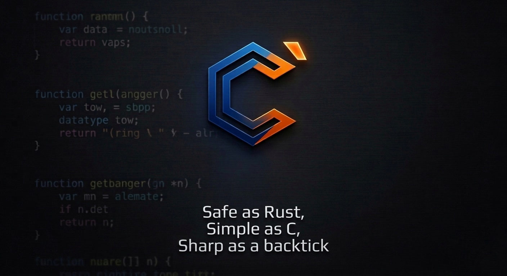
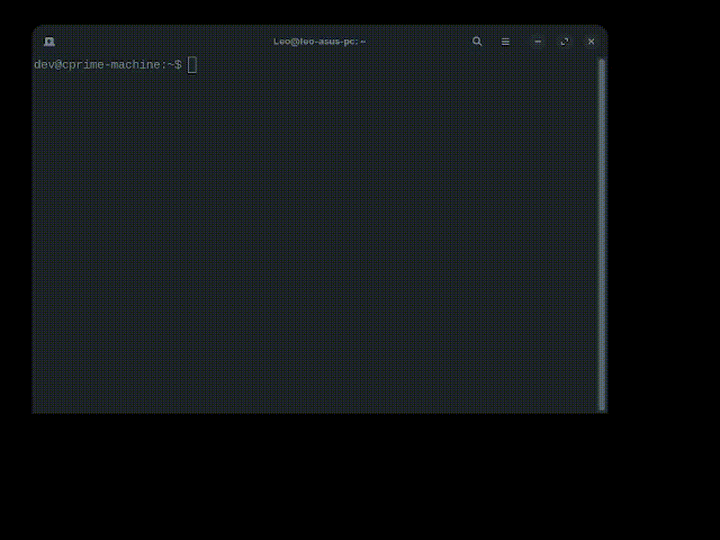

<div align="center">



# C-Prime (C\`)

### Safe as Rust, Simple as C, Sharp as a backtick.

[](LICENSE)
[](https://github.com/cprime-lang/cprime/releases/tag/v0.1.0-alpha)
[](#install)
[](#self-hosting)

**C-Prime is a systems programming language** that gives you C's speed and simplicity with Rust's memory safety — using a single new symbol: the backtick `` ` `` borrow operator.

[**C-Prime in Action**](#c-prime-in-action) · [**Install**](#install) · [**Quick Start**](#quick-start) · [**Language Tour**](#language-tour) · [**Tools**](#tools) · [**Roadmap**](#roadmap)

</div>

---

## Why C-Prime?

| | C | Rust | **C-Prime** |
|---|---|---|---|
| Memory safe | ❌ | ✅ | ✅ |
| Simple syntax | ✅ | ❌ | ✅ |
| No GC | ✅ | ✅ | ✅ |
| Compiles fast | ✅ | ❌ | ✅ |
| Self-hosted compiler | ✅ | ✅ | ✅ |
| Learning curve | Low | High | **Low** |

C-Prime adds **one concept** to C: the backtick borrow operator `` ` ``. That's it. The compiler enforces memory safety at compile time with no runtime overhead.

---

## C-Prime in Action

<div align="center">
<h3>1. Project Setup & Execution</h3>

<p><i>Zero-config project scaffolding and execution. C-Prime handles native compilation with a single command.</i></p>

<h3>2. The Borrow Operator (`)</h3>

<p><i>The backtick prefix indicates a borrow. The compiler enforces memory safety rules at compile-time with no runtime cost.</i></p>

<h3>3. Self-Hosted Compiler Verification</h3>

<p><i>Technical proof of stability: The C-Prime compiler (cpc) successfully compiling its own source code to produce an identical binary.</i></p>
</div>

---

## Install

```bash
# Download and install the .deb package
wget https://github.com/cprime-lang/cprime/releases/download/v0.1.0-alpha/cprime_0.1.0-alpha_amd64.deb
sudo dpkg -i cprime_0.1.0-alpha_amd64.deb

# Verify
cpc --version   # cpc v0.1.0-alpha (Backtick)
cpg --version   # cpg v0.1.0-alpha
cppm version    # cppm v0.1.0-alpha
```

**VS Code Extension:**
```bash
# Download from the release and install
code --install-extension cprime-lang-0.1.0-alpha.vsix
```

---

## Quick Start

```bash
# Create a new project
cppm init hello
cd hello

# Edit src/main.cp (opens with syntax highlighting if extension is installed)
code src/main.cp

# Compile and run
cppm run src/main.cp
# → Hello from C-Prime!
```

---

## Language Tour

### Hello World

```c
import io;

fn main() -> i32 {
    io.println("Hello, World!");
    return 0;
}
```

### The `` ` `` Borrow Operator

The backtick is the heart of C-Prime. It lets you lend a value without giving up ownership — enforced at compile time:

```c
import io;

fn greet(`str name) -> void {
    io.printf("Hello, %s!\n", name);
}   // name is returned to caller automatically

fn main() -> i32 {
    str message = "C-Prime";
    greet(`message);        // borrow — message still owned by main
    io.println(message);    // still valid!
    return 0;
}
```

### Mutable Borrows

```c
fn double_it(`mut i32 val) -> void {
    *val = *val * 2;
}

fn main() -> i32 {
    i32 x = 21;
    double_it(`mut x);      // mutable borrow
    io.printf("%d\n", x);   // prints 42
    return 0;
}
```

### Structs

```c
struct Person {
    str  name;
    i32  age;
}

fn greet(`Person p) -> void {
    io.printf("Hi, I'm %s and I'm %d years old.\n", p.name, p.age);
}

fn birthday(`mut Person p) -> void {
    p.age = p.age + 1;
}

fn main() -> i32 {
    Person alice = { name: "Alice", age: 30 };
    greet(`alice);
    birthday(`mut alice);
    greet(`alice);          // now 31
    return 0;
}
```

### Borrow Rules (compile-time enforced)

```c
fn main() -> i32 {
    str data = "hello";

    `str a = `data;         // ✅ immutable borrow
    `str b = `data;         // ✅ multiple immutable borrows OK
    // `mut str c = `mut data; // ❌ cannot mix mutable + immutable

    consume(data);          // ✅ move — data is consumed here
    // io.println(data);    // ❌ compile error: use after move
    return 0;
}
```

---

## Tools

| Tool | What it does |
|------|-------------|
| `cpc` | **Compiler** — compiles `.cp` files to native Linux x86_64 ELF binaries |
| `cpg` | **Guard** — static analysis: borrow violations, null dereferences, memory leaks |
| `cppm` | **Package Manager** — `init`, `run`, `build`, package registry (v0.2.0) |
| VS Code ext | Syntax highlighting, hover docs, snippets, one-click run |

```bash
# Compile directly
cpc src/main.cp -o myapp -O
./myapp

# Static analysis
cpg src/main.cp --strict

# Package manager
cppm init myproject
cppm run src/main.cp
cppm build
```

---

## Self-Hosting

C-Prime v0.1.0-alpha is **self-hosted** — the compiler is written in C-Prime and compiles itself:

```bash
# The bootstrap C compiler compiles main.cp
./build/bootstrap/cpc-bootstrap compiler/src/main.cp -o build/compiler/cpc

# Now cpc compiles itself
CPRIME_BOOTSTRAP=./build/bootstrap/cpc-bootstrap \
  ./build/compiler/cpc compiler/src/main.cp -o /tmp/cpc2

# Both binaries are identical
diff build/compiler/cpc /tmp/cpc2 && echo "SELF-HOSTING VERIFIED ✓"
```

---

## Build from Source

```bash
git clone https://github.com/cprime-lang/cprime
cd cprime

# Build the bootstrap compiler (C)
cd bootstrap && make && cd ..

# Compile cpc using bootstrap
./build/bootstrap/cpc-bootstrap compiler/src/main.cp -o build/compiler/cpc

# Verify
./build/compiler/cpc --version
```

---

## Roadmap

| Version | Status | Highlights |
|---------|--------|------------|
| **v0.1.0-alpha** | ✅ Released | Self-hosted x86_64 compiler, borrow checker, VS Code extension |
| v0.2.0-alpha | 🔧 Planned | ARM64 support, full `cpg` static analyser, package registry |
| v0.3.0-alpha | 📋 Planned | Generics `Vec<T>`, `HashMap<K,V>`, async/await |
| v1.0.0 | 🎯 Goal | Production ready, Windows support, full stdlib |

---

## License

MIT — see [LICENSE](LICENSE)

---

<div align="center">

**Built with ❤️ and a backtick.**